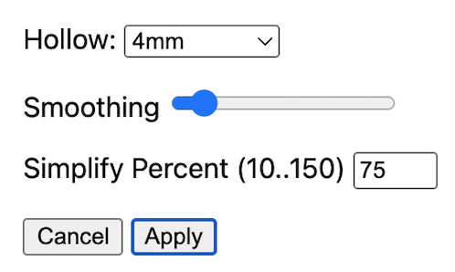

# brain2print

This is an extension of [brainchop](https://github.com/neuroneural/brainchop) that converts voxel-based MRI scans to 3D meshes that can be printed. **No data is sent to a server. *Everything* happens in your browser window, on *your* machine**. 


## Usage

1. Open the [live demo](https://niivue.github.io/brain2print/).
2. **Option 1** The web page automatically loads with a default T1 MRI scan. If you want to use this scan, go to step 5.
3. **Option 2** If your T1 MRI scan is in NIfTI format, drag and drop the file onto the web page.
4. **Option 3** If your image is in DICOM format, it may load if you drag and drop the files. If this fails, convert your images with [dcm2niix](https://niivue.github.io/niivue-dcm2niix/) and save the result as a NIfTI format file that brain2print can open.
5. Segment your brain scan by choosing a model from the `Segmentation Model` pull-down menu. Not all models work with all graphics cards. The `Tissue GWM (High Acc, Low Mem)` is a good starting point. Hopefully, it will accurately segment your brain into gray matter, white matter and cerebral spinal fluid.
6. Press the `Create Mesh` button and select your preferred settings:
  - 
  - The `Hollow` option allows you to choose between a solid object or a surface shell (which uses less material to print).
  - You can choose `Smoothing` to make the surfaces less jagged at the expense of computation time.
  - You can choose to `Simplify` to reduce the number of triangles and create smaller files.
7. Once you have set your preferences, press `Apply`.
8. You will see the mesh appear and can interactively view it. If you are unhappy with the result, repeat step 6 with different settings. If you want to print the results, press the `Save Mesh` button.

## How it Works

This web application uses some of the latest browser technologies that allow the tissue segmentation model to run on your local graphics card (GPU), regardless of the type of GPU. This is possible via the `WebGPU` browser API. Additionally, we leverage [ITK-Wasm](https://wasm.itk.org) to turn the tissue segmentation into a 3D mesh. No data ever leaves your machine.

### Developers - Running a Local Live Demo

```bash
git clone git@github.com:niivue/brain2print.git
cd brain2print
npm install
npm run dev
```


### Developers - Building the Web Page

```bash
npm run build
```

## References

This web page combines three packages developed by our team:

- [brainchop](https://github.com/neuroneural/brainchop) AI models for tissue segmentation. [Citation](https://pubmed.ncbi.nlm.nih.gov/39301517/).
- [niimath](https://github.com/rordenlab/niimath) for creating hollow objects. [Citation](https://pubmed.ncbi.nlm.nih.gov/39268148/).
- [niivue](https://github.com/niivue/niivue) reading images and visualization.
- [ITK-Wasm](https://github.com/InsightSoftwareConsortium/ITK-Wasm) for voxel-to-mesh and mesh processing. [Citation](https://proceedings.scipy.org/articles/TCFJ5130).

## Alternatives

While brain2print provides a zero-footprint operating system independent solution, it is trained only on the most popular T1-weighted images from 1.5-3.0T MR scanners. Below are alternatives that can help with different scans:

 - [ct2print.org](https://ct2print.org/) for volumes where a intensity threshold provides a meaningful isosurface.
 - [process_brain_for_printing](https://github.com/claudebajada/process_brain_for_printing) Python script for leveraging FreeSurfer, FSL, ANTs and MRtrix.
 - [Christopher R Madan's](https://riojournal.com/article/10398/) guide for printing using FreeSurfer and MeshLab.
 - [niftyweb](http://niftyweb.cs.ucl.ac.uk/program.php?p=BRAIN-STEPS) provides a [cloud-based](https://cds.ismrm.org/protected/16MProceedings/PDFfiles/2201.html) alternative.
 - [Consulting Joe](https://www.consultingjoe.com/2024/09/21/how-i-create-a-3d-model-of-my-brain-using-slicer-and-the-swiss-skull-stripper-plugin/) provides instructions for using slicer and [SwissSkullStripper](https://github.com/lassoan/SlicerSwissSkullStripper).
 - Michael Notter shares a [shell script](https://github.com/miykael/3dprintyourbrain) for printing brain with FreeSurfer, MeshLab and FSL.
 - Simon Kern [provides a docker image](https://github.com/skjerns/3dprintedbrain_docker) of Michael Notter's solution.

## Citation

  - Rorden C, McCormick M, Hanayik T, Masoud M, Plis SM, ([2025](https://www.nature.com/articles/s41598-025-00014-5?utm_source=rct_congratemailt&utm_medium=email&utm_campaign=oa_20250505&utm_content=10.1038/s41598-025-00014-5)) brain2print AI powered web tool for creating 3D printable brain models. Scientific Reports. 15: 15664. [PMID](https://pubmed.ncbi.nlm.nih.gov/40325035/) doi:10.1038/s41598-025-00014-5
